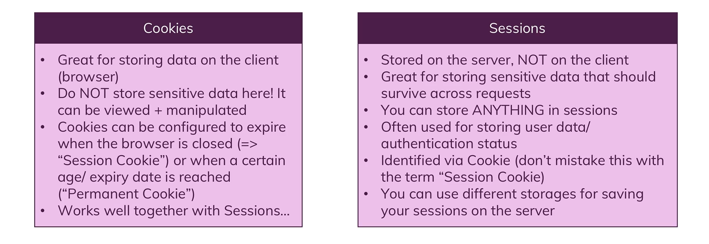
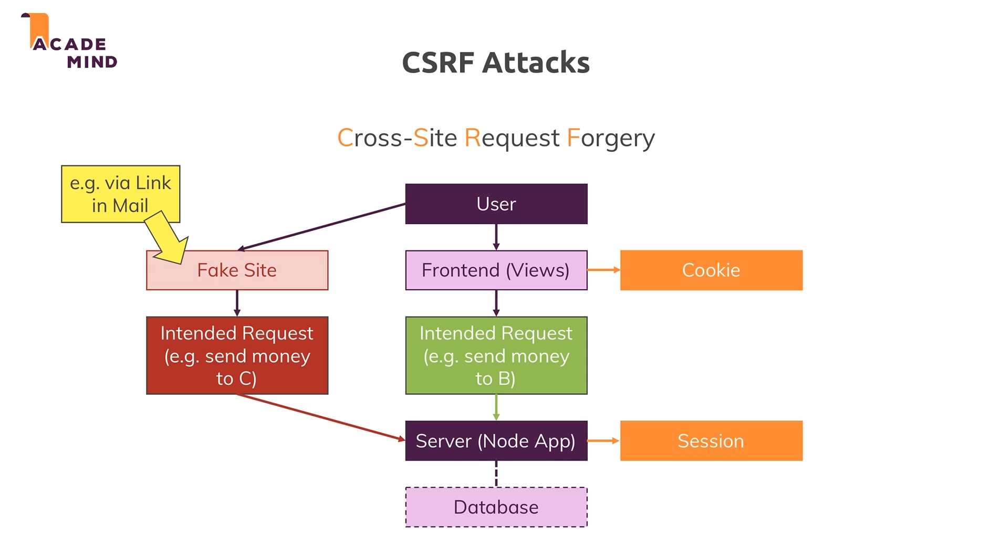
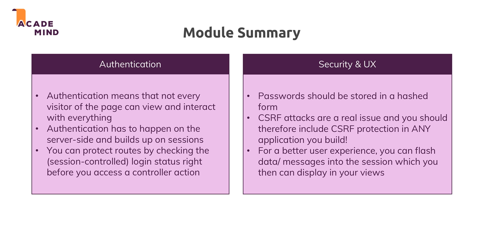

# learn-nodejs
In this project I was learning nodejs along with that creating nodejs application

# Authentication
## Session & cookies

## Authentication

About CSRF attacks- Cross site request forgery

Authentication and security summary

