# Authentication
## Session & cookies
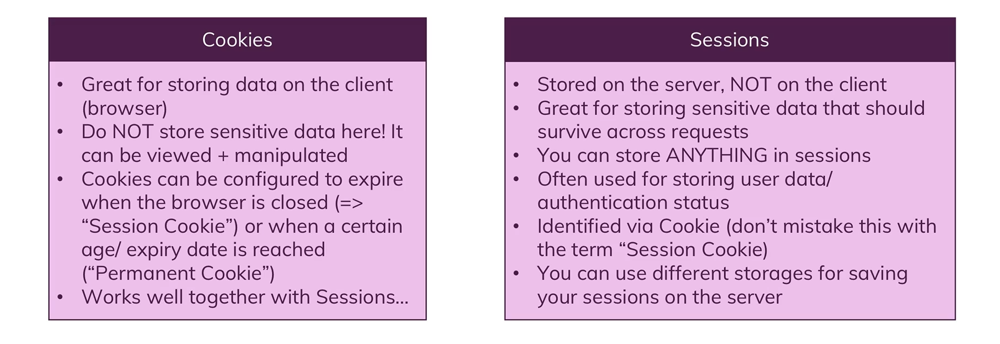

## Authentication

### About CSRF attacks- Cross site request forgery

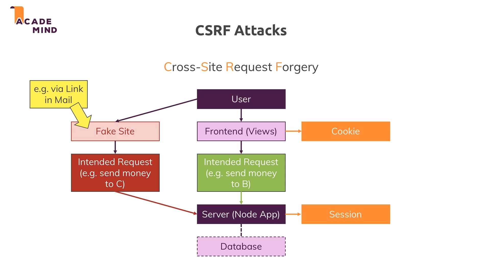

### Authentication and security summary

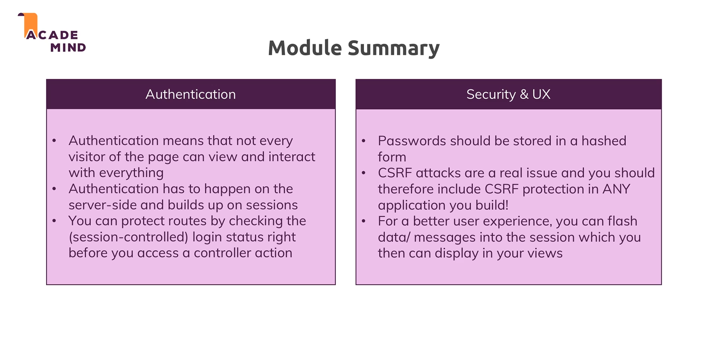

## Advanced authentication

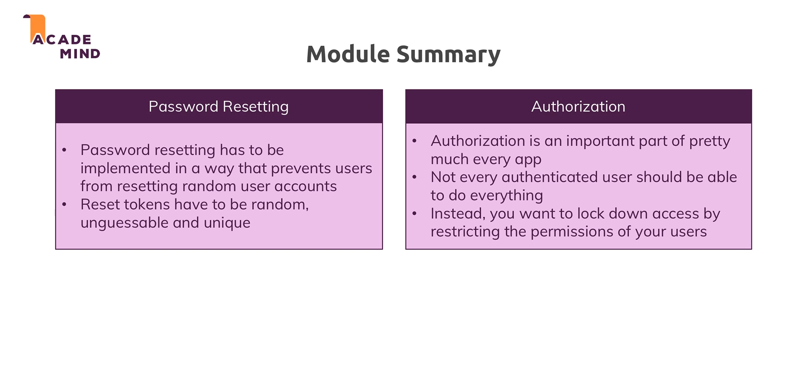

## Validation

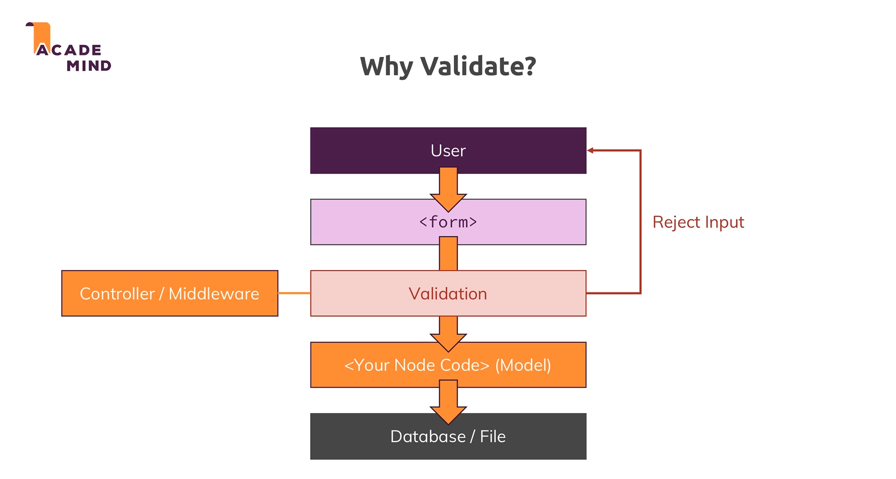
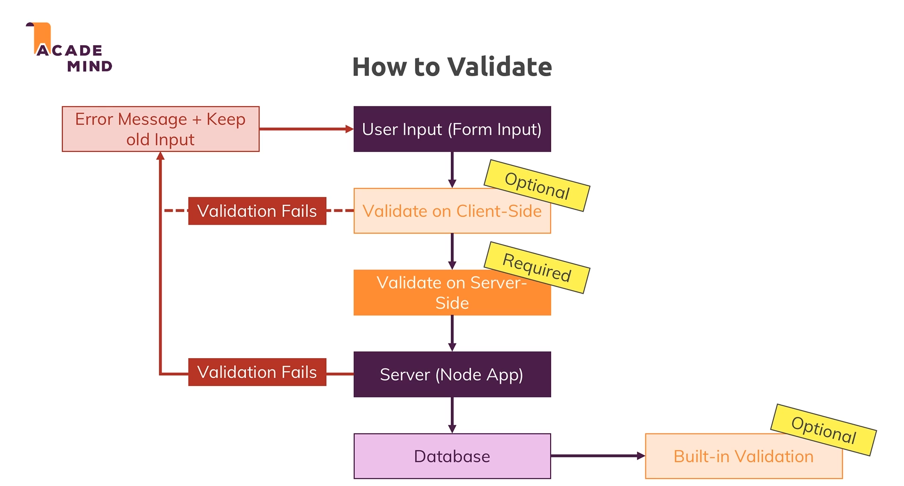

## Error handling
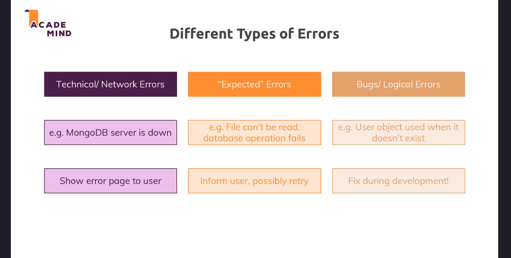
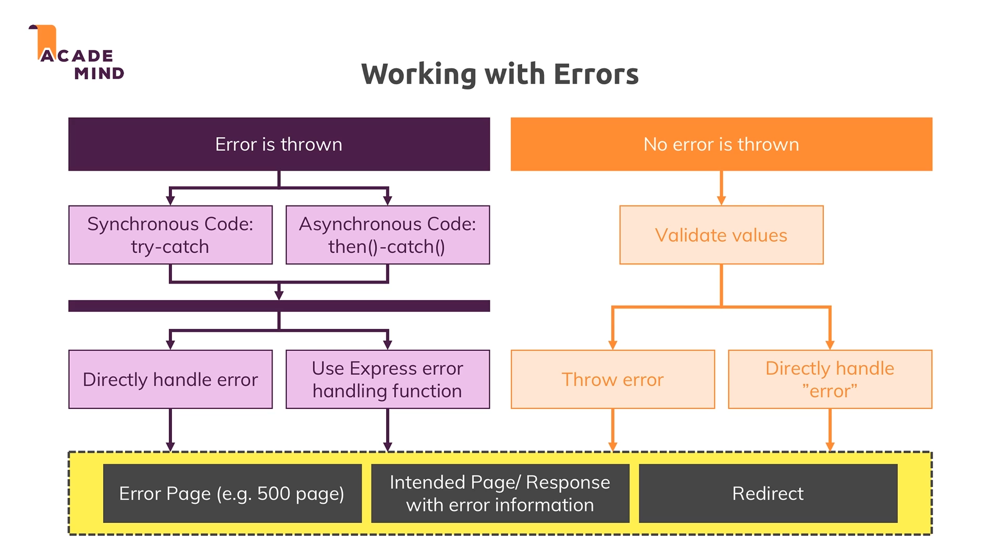
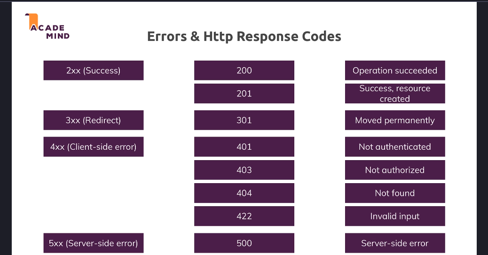
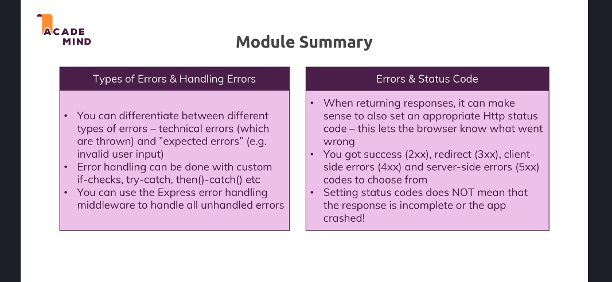

## Adding payments
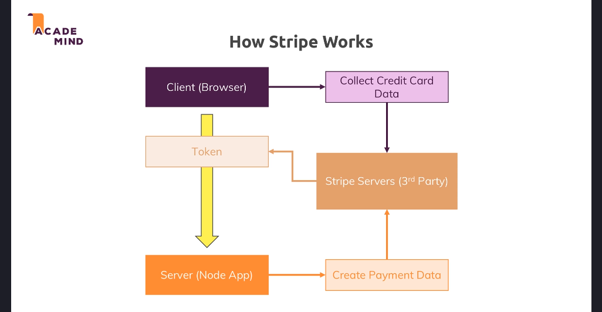

## REST APIs
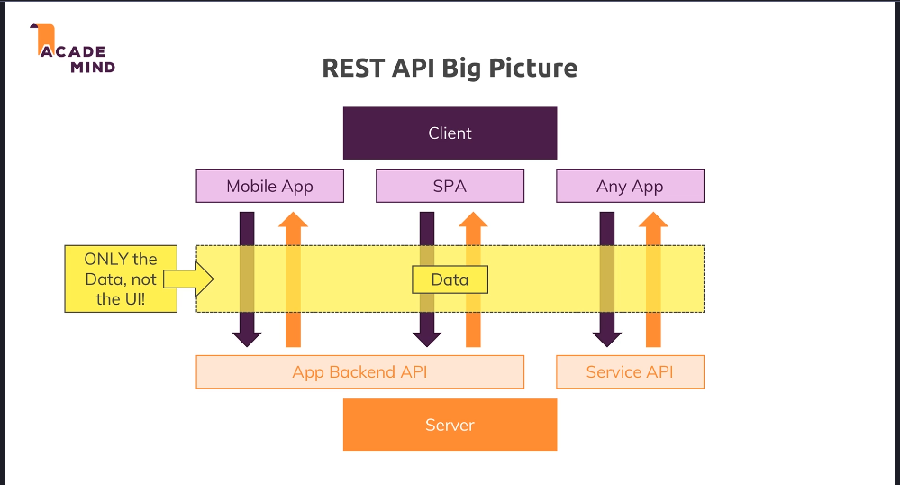
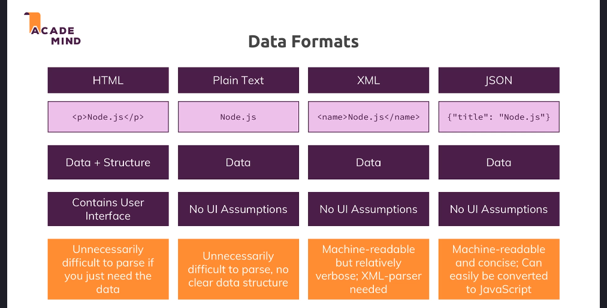
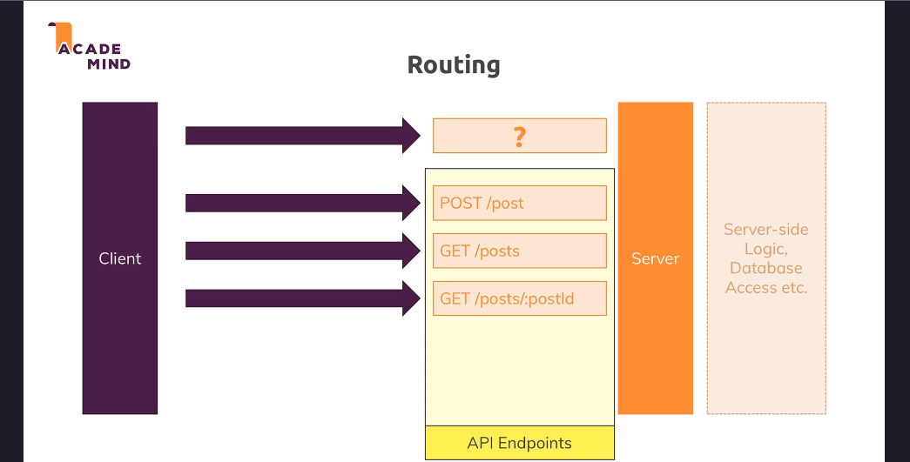
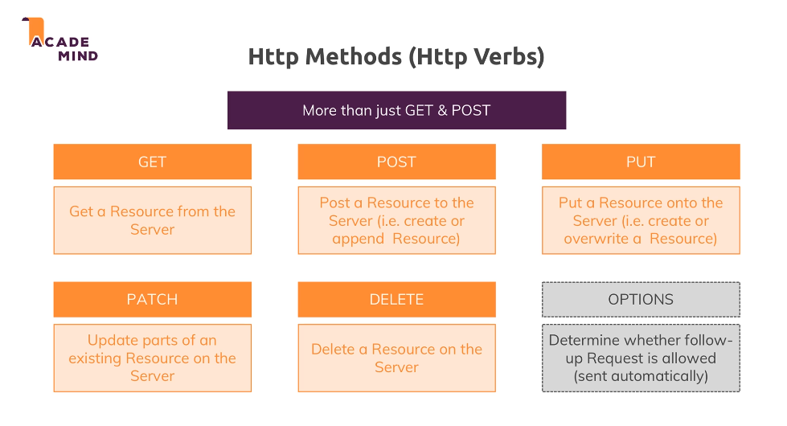
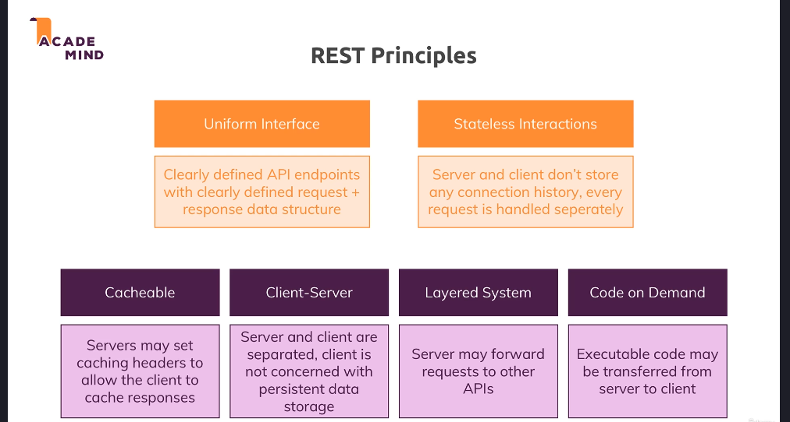